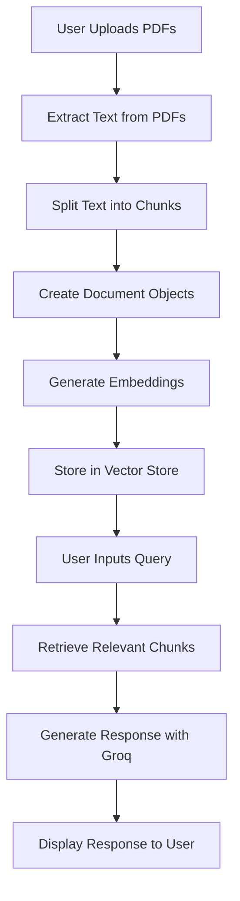

# README for Chat with Groq - Multiple PDFs Demo

## Overview
This project is a Streamlit application that allows users to upload multiple PDF files and interact with them using the Groq language model. The application extracts text from the uploaded PDFs, processes it, and enables users to ask questions based on the content of these documents.

## Key Concepts
- **Retrieval-Augmented Generation (RAG)**: This approach combines retrieval and generation techniques. The application retrieves relevant text chunks from the uploaded PDFs based on user queries and then generates responses using the Groq model.
- **Vector Store**: The application utilizes a vector store (Chroma) to manage embeddings of text chunks. This allows for efficient retrieval of relevant information when responding to user queries.
- **Text Splitting**: The application splits the extracted text into manageable chunks using `RecursiveCharacterTextSplitter`, which helps in processing large documents effectively.

## Flow Diagram


## Installation
To set up this project, follow these steps:

1. **Clone the repository**:
   ```bash
   git clone <repository-url>
   cd <repository-directory>
   ```

2. **Create a virtual environment** (optional but recommended):
   ```bash
   python -m venv venv
   source venv/bin/activate  # On Windows use `venv\Scripts\activate`
   ```

3. **Install required packages**:
   ```bash
   pip install -r requirements.txt
   ```

4. **Set up environment variables**:
   Create a `.env` file in the project root and add your Groq API key:
   ```
   GROQ_API_KEY=your_api_key_here
   ```

5. **Run the Streamlit app**:
   ```bash
   streamlit run app.py
   ```

## Usage
1. Open your browser and navigate to the URL provided by Streamlit (usually `http://localhost:8501`).
2. Use the file uploader to upload multiple PDF files.
3. Enter your query in the input box and submit it to receive responses based on the content of your uploaded documents.

## Code Explanation
The main components of the code include:

- **PDF Text Extraction**: Using `PyPDF2` to read and extract text from PDF files.
- **Text Processing**: Utilizing `RecursiveCharacterTextSplitter` to break down long texts into smaller chunks for better handling.
- **Vector Store Creation**: Creating embeddings of text chunks using `HuggingFaceEmbeddings` and storing them in Chroma for efficient retrieval.
- **Groq Integration**: Setting up a chat model using `ChatGroq` that generates responses based on user queries and context extracted from PDFs.

This README provides a comprehensive overview of how to set up and use the Chat with Groq - Multiple PDFs Demo application, along with key concepts and installation instructions.

Citations:
[1] https://www.reddit.com/r/Streamlit/comments/13oc9ob/using_streamlit_to_upload_multiple_files_to/
[2] https://discuss.streamlit.io/t/import-errors/46195
[3] https://discuss.streamlit.io/t/uploading-multiple-files-with-file-uploader/1445
[4] https://github.com/dataprofessor/langchain-ask-the-doc/blob/master/streamlit_app.py
[5] https://stackoverflow.com/questions/77555742/streamlit-dynamically-open-multiple-pdfs-files-in-different-tabs/78068936
[6] https://api.python.langchain.com/en/latest/chat_models/langchain_groq.chat_models.ChatGroq.html
[7] https://github.com/petermartens98/OpenAI-LangChain-Multi-PDF-Chat-Bot
[8] https://python.langchain.com/docs/integrations/chat/groq/
[9] https://docs.streamlit.io/develop/api-reference/widgets/st.file_uploader
[10] https://discuss.streamlit.io/t/how-to-upload-a-pdf-file-in-streamlit/2428